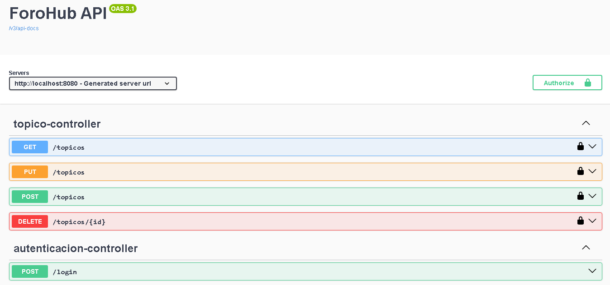

# ForoHub API

API REST desarrollada con **Java Spring Boot** para la gestión de tópicos en un foro.  
Incluye autenticación mediante login y operaciones CRUD sobre los tópicos.

---

## 🚀 Tecnologías utilizadas
- Java 17+
- Spring Boot 3.x
- Spring Security + JWT
- Spring Data JPA / Hibernate
- Flyway (migraciones de base de datos)
- MySQL (o H2 para pruebas)
- Swagger (documentación interactiva)

---

## 📌 Endpoints principales



### 🔐 Autenticación
- **POST** `/login` → Inicia sesión y devuelve un **JWT Token**.  
  Se debe enviar:
  ```json
  {
    "mail": "usuario@correo.com",
    "password": "contraseña"
  }

### 📚 Tópicos

Todos los endpoints requieren autenticación con Bearer Token obtenido en /login.

- **GET** /topicos → Listar todos los tópicos.

- **POST** /topicos → Crear un nuevo tópico.

Ejemplo body:


    {
    "id": 1,
    "titulo": "Error en configuración de Spring",
    "mensaje": "Tengo un problema con mi archivo application.properties",
    "fecha": "2025-08-16T23:30:00"
    }


- **PUT** /topicos → Actualizar un tópico existente.

- **DELETE** /topicos/{id} → Eliminar un tópico por ID.
